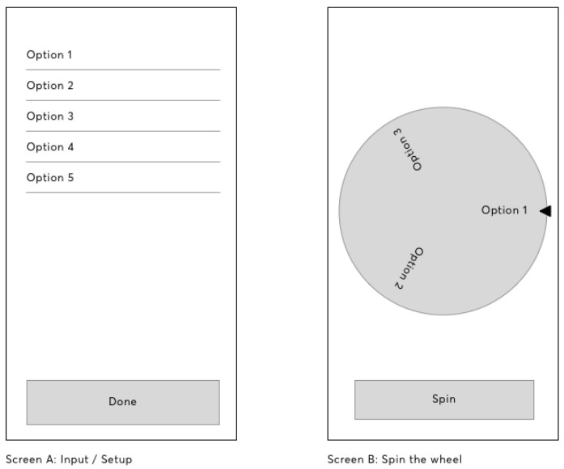
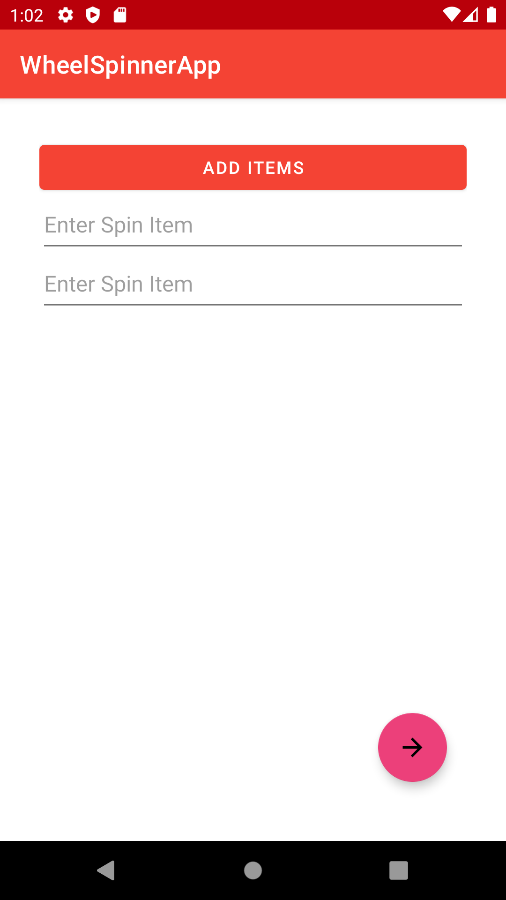
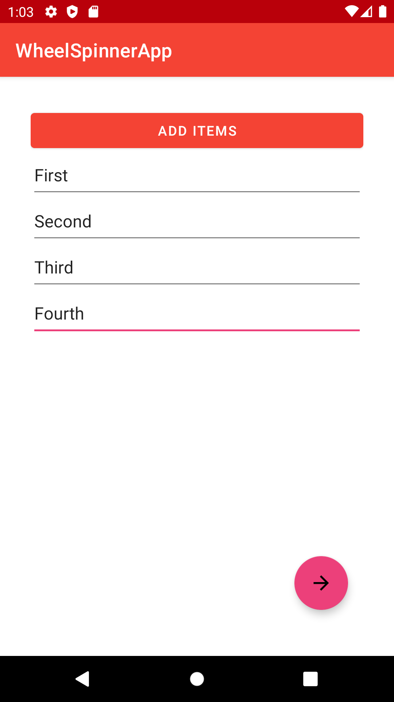
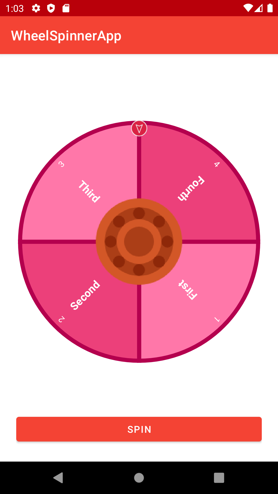
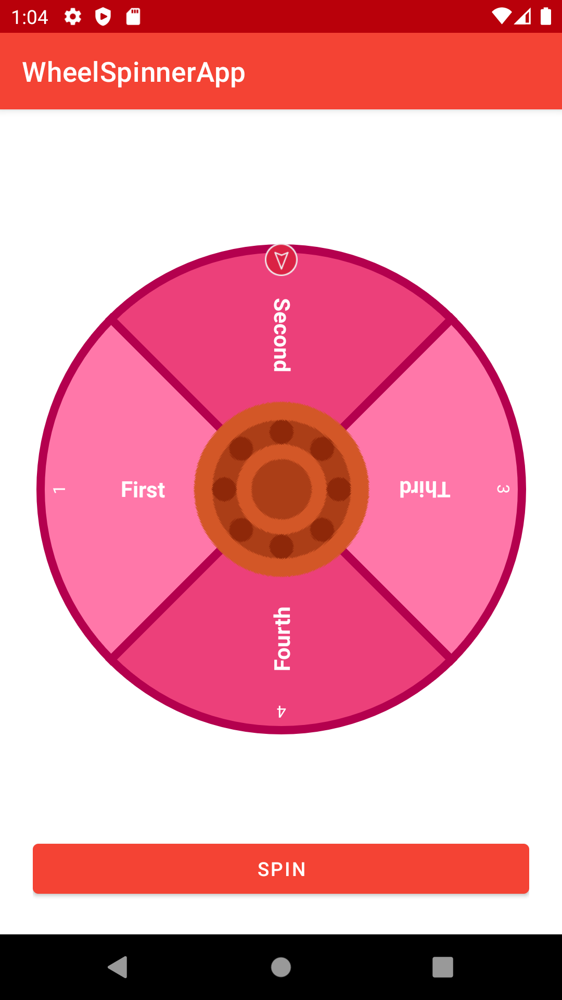

# Cool-Wheely-App
This sample app is made to demonstrate my Android/Kotlin development skills.

The App only has two screens; one that allows a user to add values to “The Wheel”, and one
where the Wheel can be spun for a random result.

Wireframe: 

**Screen A**

The initial screen of the app should be the input screen. Here you should be able to add the
values for the various options which will appear on “The Wheel” and navigate to the next screen.
By default, two text boxes are available but user can create more items by pressing the 'Add Items' button. 

*No check on whether input is valid (length > 0) yet*

**Screen B**

The main screen of the app should showcase “The Wheel”. The options entered by the user in
Screen A should appear evenly distributed in some form. Clicking the “Spin” button should cause
a rotation animation of “The Wheel” and finally settle on a random option.

